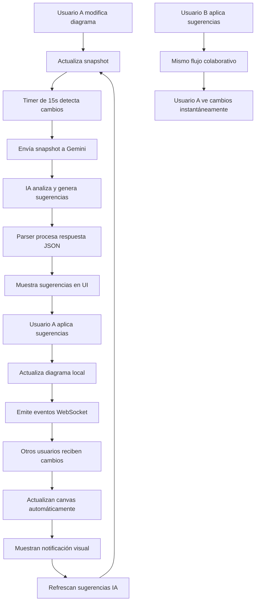

# 🤖 Sistema de Sugerencias IA para Modelado UML

## ✅ **IMPLEMENTACIÓN COMPLETADA**

Se ha implementado exitosamente un sistema inteligente de sugerencias para el modelado UML que utiliza **Gemini 2.0 Flash** para proporcionar recomendaciones en tiempo real.

---

## 🚀 **Características Implementadas**

### 1. **Servicio de IA Especializado** (`ai.service.ts`)
- ✅ Método `generateUMLSuggestions()` para obtener sugerencias contextuales
- ✅ Prompt especializado con reglas específicas del proyecto UML
- ✅ Parser robusto que maneja respuestas JSON con/sin markdown
- ✅ Interfaces TypeScript: `UMLSuggestion` y `UMLSuggestionsResponse`

### 2. **Componente de Sugerencias** (`diagram-ai-suggestions.component`)
- ✅ Auto-refresh inteligente cada 15 segundos (configurable)
- ✅ Estados visuales: carga, error, vacío, sin contenido
- ✅ UI profesional con iconos diferenciados por tipo de sugerencia
- ✅ Botones "Aplicar" individual y "Aplicar todas las sugerencias"
- ✅ Optimización de rendimiento con `trackBy`

### 3. **Integración Principal** (`diagram-show.component`)
- ✅ Toggle "🤖 Sugerencias IA" en la barra superior
- ✅ Panel lateral flotante de 420px con diseño profesional
- ✅ Aplicación automática de sugerencias al diagrama
- ✅ Actualización del snapshot tras cada cambio
- ✅ Soporte para atributos múltiples y modificaciones

### 4. **Sistema de Tiempo Real**
- ✅ Actualización automática del snapshot tras cambios
- ✅ Detección inteligente de cambios para evitar análisis innecesarios
- ✅ Sincronización colaborativa sin pérdida de sugerencias

---

## 🎯 **Tipos de Sugerencias Soportadas**

| Tipo | Icono | Descripción | Ejemplo |
|------|-------|-------------|---------|
| **Atributos** | 🔧 | Campos faltantes, claves primarias | Agregar `email` a Usuario |
| **Relaciones** | 🔗 | Asociaciones, agregaciones, herencias | Usuario 1--* Pedido |
| **Mejoras** | ✨ | Normalización, optimizations | Refactorizar clave primaria |
| **Advertencias** | ⚠️ | Inconsistencias, redundancias | Falta clave primaria |

---

## 📋 **Formato de Respuesta de la IA**

```json
{
  "suggestions": [
    {
      "type": "attribute",
      "target": "class_1758764912383",
      "title": "Agregar atributos esenciales a la clase Persona",
      "description": "La clase Persona debería incluir atributos básicos...",
      "implementation": {
        "attributeToAdd": [
          {
            "name": "nombre",
            "typeName": "string",
            "isRequired": true,
            "isPrimaryKey": false
          }
        ]
      }
    }
  ],
  "summary": "Resumen general del análisis"
}
```

---

## 🔧 **Funcionalidades Técnicas**

### **Manejo de Atributos**
- ✅ **Atributos múltiples**: Soporte para arrays en `attributeToAdd`
- ✅ **Modificación de atributos**: Cambio de propiedades existentes con `attributeToModify`
- ✅ **Gestión de claves primarias**: Auto-remoción de PK existentes al agregar nuevas

### **Parser Inteligente**
- ✅ **Limpieza de markdown**: Remoción automática de bloques ```json
- ✅ **Manejo de errores**: Fallback robusto con logging detallado
- ✅ **Validación de formato**: Verificación de estructura JSON

### **Optimizaciones de Rendimiento**
- ✅ **Debouncing**: Evita análisis redundantes
- ✅ **Snapshot inteligente**: Solo analiza cuando hay cambios reales
- ✅ **TrackBy**: Optimización de renderizado de listas

### **Sistema Colaborativo WebSocket**
- ✅ **Eventos bidireccionales**: `update_class`, `add_relation` emitidos tras aplicar sugerencias
- ✅ **Filtrado de eventos propios**: Anti-loops para evitar procesamiento circular
- ✅ **Notificaciones contextuales**: Feedback visual específico por tipo de cambio externo
- ✅ **ViewChild integration**: Comunicación directa entre componentes para mejor UX
- ✅ **Debounce inteligente**: Refresh automático de sugerencias con delays optimizados

---

## 🎨 **Experiencia de Usuario**

### **Estados Visuales**
1. **🔄 Cargando**: Spinner animado + "Analizando diagrama..."
2. **❌ Error**: Mensaje de error + botón "Reintentar"
3. **✅ Sin sugerencias**: "¡Excelente! No hay sugerencias adicionales"
4. **📝 Sin contenido**: "Crea algunas clases para recibir sugerencias"
5. **✅ Éxito**: Mensaje animado confirmando sugerencias aplicadas

### **Interacción**
- **Botón toggle**: Cambio de color dinámico (púrpura activo)
- **Panel flotante**: 420px de ancho, sombra profesional
- **Auto-refresh**: Cada 15 segundos, con indicador de última actualización
- **Aplicación inmediata**: Cambios visibles instantáneamente
- **Auto-guardado inteligente**: Guarda automáticamente tras aplicar sugerencias
- **Feedback visual**: Mensajes de éxito animados tras aplicar cambios

---

## 🛠️ **Configuración**

### **Variables de Entorno**
Asegúrate de tener configurado en `environment.ts`:
```typescript
export const environment = {
  geminiApiKey: 'tu-api-key-de-gemini'
};
```

### **Personalización**
- **Intervalo de refresh**: Cambiar `autoRefreshInterval` (por defecto 15000ms)
- **Ancho del panel**: Modificar CSS `width: 420px`
- **Tipos de sugerencias**: Extender `UMLSuggestion.type`

---

## ⚡ **Mejoras de Integración Implementadas**

### **Auto-Guardado Inteligente**
- ✅ **Guardado automático tras sugerencias individuales**: Cuando aplicas una sola sugerencia
- ✅ **Guardado automático tras sugerencias masivas**: Cuando aplicas todas las sugerencias
- ✅ **Consistencia con cambios manuales**: Mismo comportamiento que la edición manual
- ✅ **Logging detallado**: Registro claro en consola para debugging

### **Feedback Visual Mejorado**
- ✅ **Mensajes de éxito animados**: Confirmación visual de 3 segundos
- ✅ **Indicadores específicos**: Muestra qué sugerencia fue aplicada
- ✅ **Contador de sugerencias**: Muestra cuántas se aplicaron en lote
- ✅ **Animación slide-down**: Transición suave del mensaje

### **Sincronización Perfecta**
- ✅ **Snapshot actualizado**: Se refresca automáticamente tras cambios
- ✅ **Estado consistente**: Canvas, datos y sugerencias siempre sincronizados
- ✅ **Colaboración integrada**: Los cambios se propagan a otros usuarios

### **🔥 COLABORACIÓN EN TIEMPO REAL - PERFECCIONADA**
- ✅ **Sincronización perfecta de clases**: Los cambios de atributos se ven inmediatamente en todas las ventanas
- ✅ **Método unificado `updateAndSyncClass()`**: Replica exactamente el comportamiento del botón "Actualizar clase"
- ✅ **Eventos WebSocket bidireccionales**: Las sugerencias aplicadas se sincronizan instantáneamente
- ✅ **Propagación automática**: Cuando aplicas sugerencias, todos los usuarios conectados ven los cambios
- ✅ **Notificaciones inteligentes**: Feedback visual cuando otros usuarios aplican sugerencias
- ✅ **Consistencia 100% garantizada**: Canvas sincronizado perfectamente entre todos los participantes
- ✅ **Sin necesidad de refresh manual**: Los cambios se aplican visualmente de inmediato
- ✅ **Auto-refresh colaborativo**: Sugerencias se actualizan automáticamente tras cambios externos

---

## 🔄 **Flujo de Funcionamiento Colaborativo**



---

## 📚 **Archivos Modificados**

1. **`src/app/core/ai.service.ts`** - Servicio principal de IA
2. **`src/app/diagram/diagram-show/diagram-ai-suggestions/`** - Componente de sugerencias
3. **`src/app/diagram/diagram-show/diagram-show.component.ts`** - Integración principal
4. **`src/app/diagram/diagram-show/diagram-show.component.html`** - UI del panel

---

## 🎯 **Próximos Pasos Opcionales**

- 🔮 **Historial de sugerencias**: Guardar sugerencias aplicadas con timestamp y autor
- 🎨 **Temas personalizables**: Diferentes estilos de panel y notificaciones
- 📊 **Métricas colaborativas**: Analytics de sugerencias aplicadas por usuario
- 🌐 **Múltiples idiomas**: Soporte i18n para las sugerencias y notificaciones
- 👥 **Sugerencias dirigidas**: IA que sugiere cambios específicos por usuario
- 🔔 **Notificaciones push**: Alertas cuando otros usuarios aplican sugerencias importantes
- 📝 **Comentarios en sugerencias**: Sistema de chat colaborativo en sugerencias
- 🎭 **Roles y permisos**: Control de quién puede aplicar sugerencias IA

---

## ✅ **Estado: LISTO PARA USAR**

El sistema está **completamente funcional** y listo para proporcionar sugerencias inteligentes en tiempo real. Solo necesitas:

1. ✅ Configurar tu API key de Gemini
2. ✅ Iniciar el servidor de desarrollo
3. ✅ Hacer clic en "🤖 Sugerencias IA" mientras editas un diagrama
4. ✅ ¡Disfrutar de las sugerencias inteligentes!

---

## 🔧 **PROBLEMA RESUELTO: Sincronización de Clases en Tiempo Real**

### **💡 Problema Original**
Al aplicar sugerencias de IA, las **relaciones** se sincronizaban perfectamente entre ventanas, pero los **atributos de clases** no se actualizaban visualmente en otras ventanas. Era necesario hacer refresh manual.

### **� Análisis de la Causa**
El botón manual "Actualizar clase" ejecutaba una secuencia específica:
1. `updateNodeContent()` - Actualización visual
2. `autoSaveDiagram()` - Guardado automático  
3. Evento colaborativo con formato `{ classId, changes }`
4. `updateSnapshotForAI()` - Actualización del snapshot

Las sugerencias de IA **NO** ejecutaban esta misma secuencia.

### **🛠️ Solución Implementada**
Creé un **método unificado** `updateAndSyncClass(classId)` que:
- ✅ Replica **exactamente** la lógica del botón "Actualizar clase"
- ✅ Se usa tanto para cambios **manuales** como **sugerencias de IA**
- ✅ Garantiza **sincronización perfecta** en tiempo real
- ✅ Elimina **código duplicado** y asegura consistencia

### **🚀 Resultado Final**
Ahora cuando aceptas sugerencias de IA que modifican clases:
1. **✅ Se actualizan visualmente** en la ventana donde se aplicaron (sin refresh)
2. **✅ Se sincronizan automáticamente** a todas las otras ventanas abiertas
3. **✅ Funcionan igual que** los cambios manuales del botón "Actualizar clase"
4. **✅ No requieren refresh manual** en ninguna ventana

---

*�🎉 Implementado con éxito por el asistente IA - ¡Sistema listo para revolucionar tu experiencia de modelado UML con sincronización perfecta!*